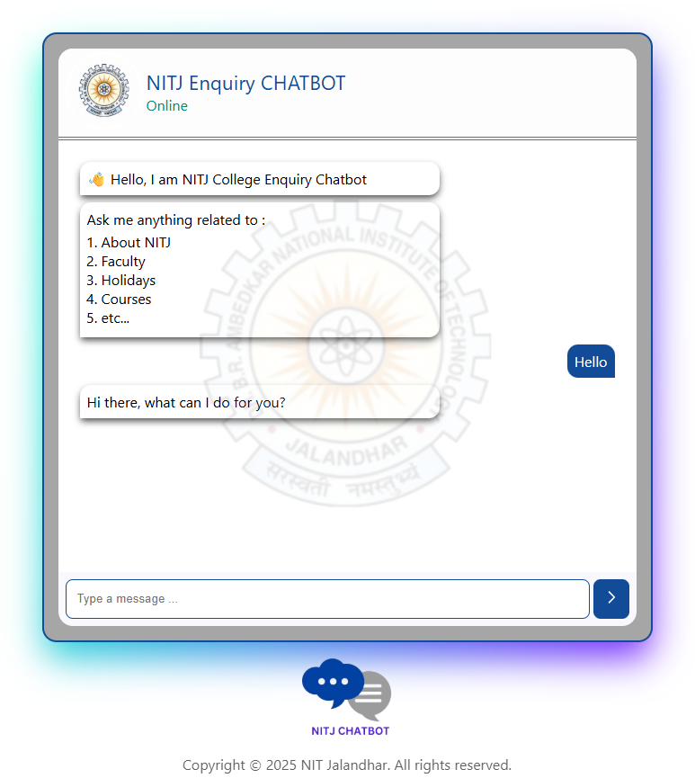
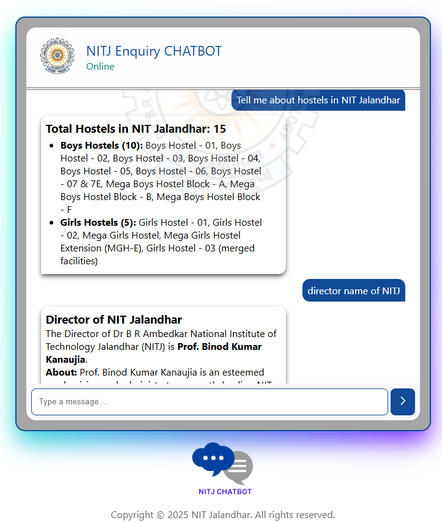
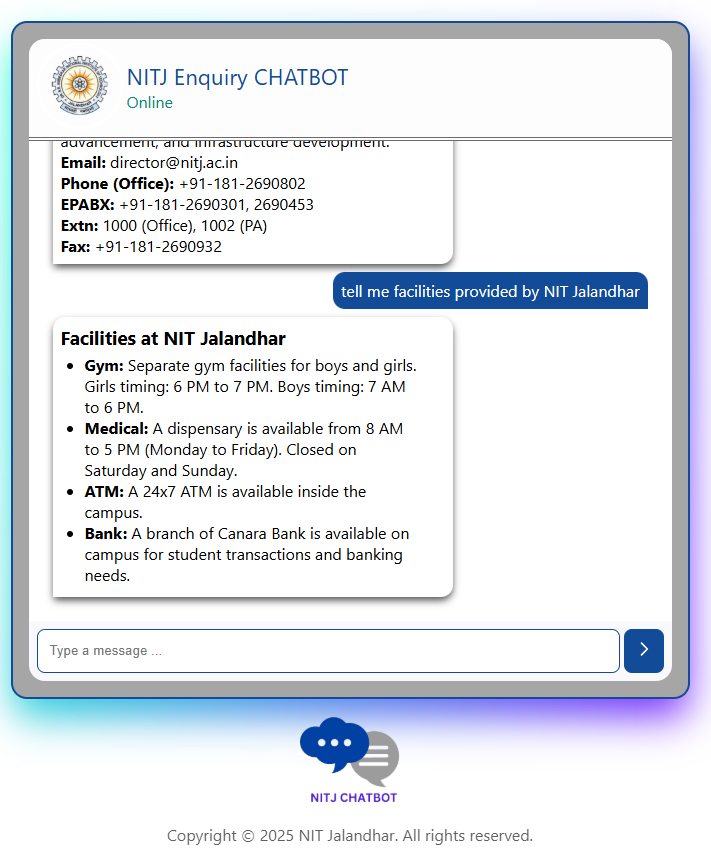
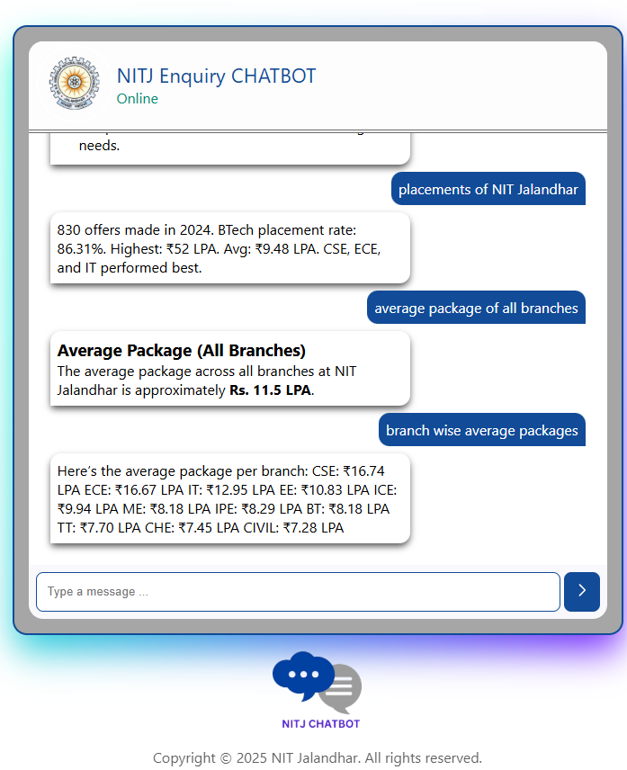

# College Enquiry Chatbot

## What does this College Enquiry Chatbot do ?

This chatbot will respond to students' queries regarding university. Questions like "When are holidays ? ", "Can you tell more about teachers?","How long does MCA take ?","What is my CGPA this sem" can be answered by this chatbot.

All features :

- Queries related to faculty
- Course details & syllabus
- Campus Facilities

## Tech Stack

- **server** - python & flask
- **frontend** - html,css,js
- **neural network** - python & pytorch
- **natural language processing** - spacy & nltk

## Getting started

Go to [Instructions.md](./Instructions.md) to know how to use this repo.
Watch the [Instructions](./instructions.mp4) here.

First create a virtual environment using `virtualenv venv` command in **terminal/cmd prompt/powershell**. Then activate it. Now we can install our dependencies for this project inside this isolated virtual environment.

We will install the following libraries to get started :

- **torch** - to create the neural network
- **nltk & spacy** - for NLP (natural language processing)
- **flask** - to run the web server where
  - we will interact with our chatbot
  - admin dashboard to manage our teachers, students, courses

> I went to Pytorch's [ official guide ](https://pytorch.org/get-started/locally/)to start local developement & got the command I need to install pytorch with cuda.

I used `pip install nltk spacy flask` to install them together. Then I use `python -m spacy download en_core_web_sm` to download english core small version.

**Note** : I have used CUDA (GPU) so torch versions have `+cu116` written. When installing from _requirements.txt_ use this command :

`pip install -r requirements.txt -f https://download.pytorch.org/whl/torch_stable.html`

## Project structure

```
-- flask_server (this is the server)
        -- static (contains css & js files)
        -- templates (contains all html files)
        -- university
            -- __init__.py (to help importing university folder easily throughout the project)
            -- models.py (contains database models)
            -- routes.py (contains routes for university related views & apis)
        -- __init__.py (initializing base flask app throughout the project)
        -- university.db
-- chat.py
-- neural_net.py (base model for neural net)
-- nlp_utils.py
-- train.py (run this file to train our neural net)
-- run.py ( this file will run our flask sever)
-- intents.json (dataset for training)
-- requirement.txt (stores the name & versions of the libraries used)
```

## How It Works

1. **`intents.json`** – Contains tags (like `"admission"`), patterns (user queries), and responses.
2. **Training** – The `chat.py` file:
   - Tokenizes and stems user inputs.
   - Converts text into a bag-of-words vector.
   - Uses a feedforward neural network to classify input into one of the known intents.
   - Trains using PyTorch with augmentation and early stopping.
3. **Model Saving** – Trained model is saved in `data.pth`.
4. **Inference** – User queries are tokenized, converted into vectors, and classified.
5. **Response Generation** – Based on the predicted tag, a random response from `intents.json` is returned.

## Reference

[📄 Project SetUp Guide (Google Doc)](https://docs.google.com/document/d/1E0-aEIbrzIPehTXmDWR5E1tKFntN2CnDQazu0wP5tbo/edit?usp=sharing)

## intents.json Sample Format

```json
{
  "intents": [
    {
      "tag": "greeting",
      "patterns": ["Hi", "Hello", "Hey there"],
      "responses": ["Hello! How can I help you about NITJ?"]
    },
    {
      "tag": "admission",
      "patterns": [
        "What are the admission criteria?",
        "How to apply for NITJ?"
      ],
      "responses": ["You can apply via JoSAA counseling after JEE Mains."]
    }
  ]
}
```

## Screenshots

###Home Page





